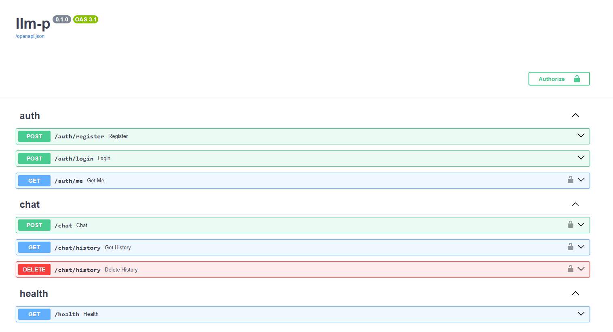
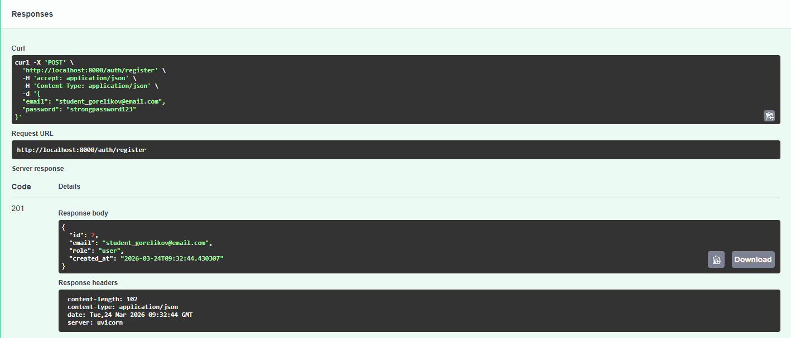
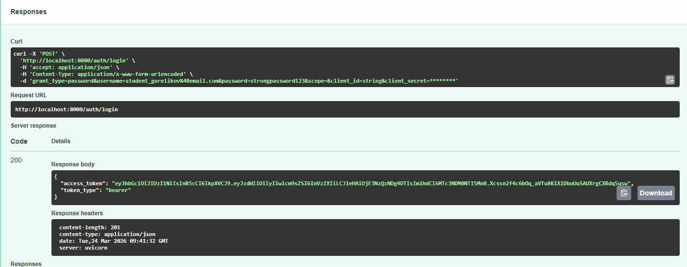
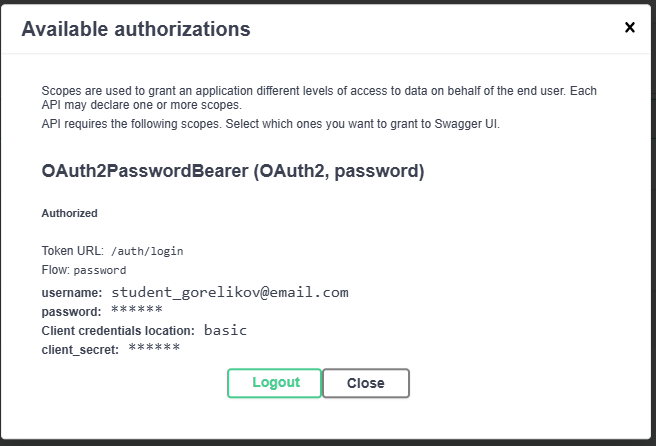
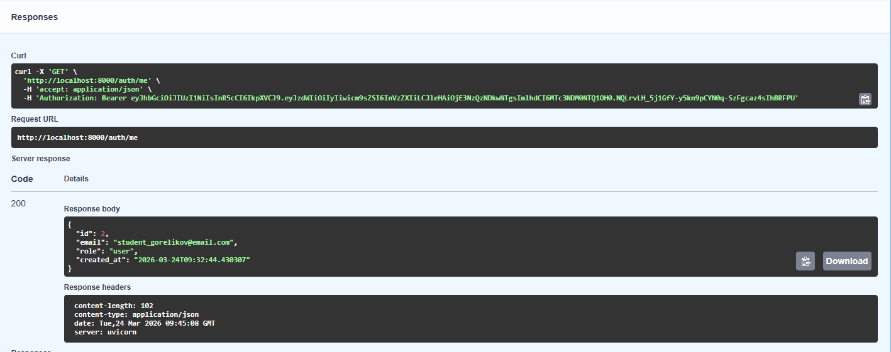
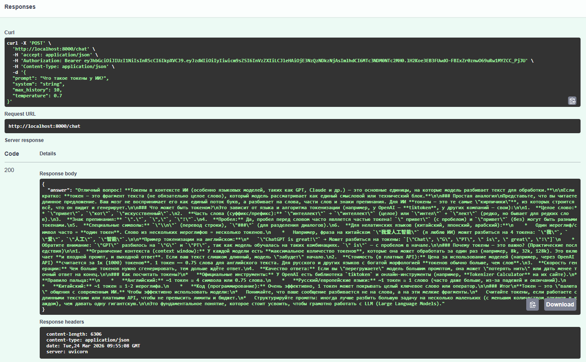
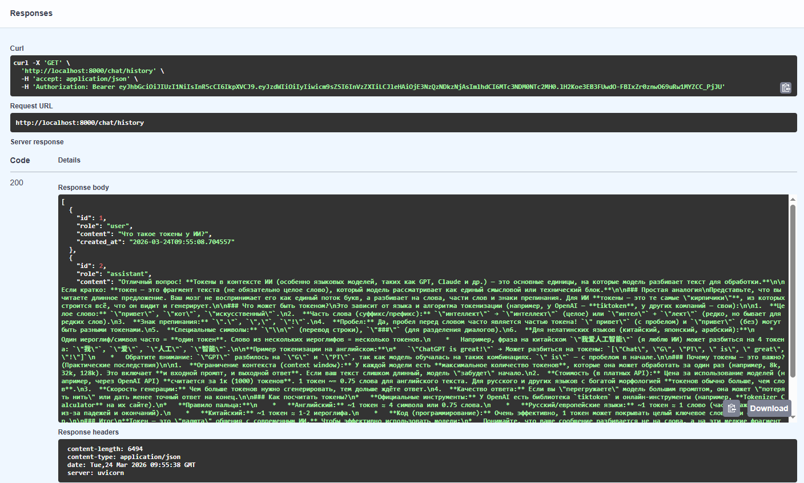
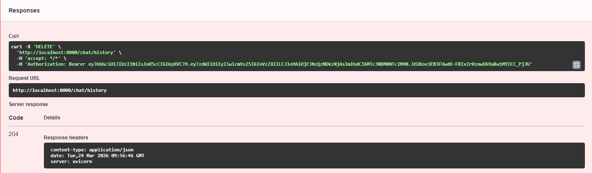

# llm-p

FastAPI-сервис с JWT-аутентификацией, SQLite и проксированием запросов к LLM через OpenRouter.

---

## Структура проекта

```
llm-p/
├── pyproject.toml              # Зависимости проекта (uv)
├── README.md                   # Описание проекта и запуск
├── .env.example                # Пример переменных окружения
├── .python-version             # Версия Python для uv
│
├── app/
│   ├── __init__.py
│   ├── main.py                 # Точка входа FastAPI
│   │
│   ├── core/                   # Общие компоненты и инфраструктура
│   │   ├── __init__.py
│   │   ├── config.py           # Конфигурация приложения (env → Settings)
│   │   ├── security.py         # JWT, хеширование паролей
│   │   └── errors.py           # Доменные исключения
│   │
│   ├── db/                     # Слой работы с БД
│   │   ├── __init__.py
│   │   ├── base.py             # DeclarativeBase
│   │   ├── session.py          # Async engine и sessionmaker
│   │   └── models.py           # ORM-модели (User, ChatMessage)
│   │
│   ├── schemas/                # Pydantic-схемы (вход/выход API)
│   │   ├── __init__.py
│   │   ├── auth.py             # Регистрация, логин, токены
│   │   ├── user.py             # Публичная модель пользователя
│   │   └── chat.py             # Запросы и ответы LLM
│   │
│   ├── repositories/           # Репозитории (только SQL/ORM)
│   │   ├── __init__.py
│   │   ├── users.py            # Доступ к таблице users
│   │   └── chat_messages.py    # Доступ к истории чатов
│   │
│   ├── services/               # Внешние сервисы
│   │   ├── __init__.py
│   │   └── openrouter_client.py  # Клиент OpenRouter / LLM
│   │
│   ├── usecases/               # Бизнес-логика приложения
│   │   ├── __init__.py
│   │   ├── auth.py             # Регистрация, логин, профиль
│   │   └── chat.py             # Логика общения с LLM
│   │
│   └── api/                    # HTTP-слой (тонкие эндпоинты)
│       ├── __init__.py
│       ├── deps.py             # Dependency Injection
│       ├── routes_auth.py      # /auth/*
│       └── routes_chat.py      # /chat/*
│
└── app.db                      # SQLite база (создаётся при запуске)
```

Архитектура построена на принципе разделения ответственности: `API → UseCases → Repositories → DB / Services`. Каждый слой взаимодействует только с соседним, бизнес-логика не попадает в эндпоинты, а SQL-запросы — в usecase.

---

## Требования

- Python 3.11 или выше
- [uv](https://docs.astral.sh/uv/) — менеджер зависимостей и виртуального окружения
- API-ключ [OpenRouter](https://openrouter.ai/)

---

## Установка и запуск

### 1. Установить uv

```bash
pip install uv
```

### 2. Клонировать репозиторий и перейти в папку проекта

```bash
cd llm-p
```

### 3. Создать виртуальное окружение

```bash
uv venv --python 3.xx
```

### 4. Активировать виртуальное окружение

Windows:
```bash
.venv\Scripts\activate
```

macOS / Linux:
```bash
source .venv/bin/activate
```

### 5. Установить зависимости

```bash
uv pip compile pyproject.toml -o requirements.txt
uv pip install -r requirements.txt
```

### 6. Настроить переменные окружения

Скопировать `.env.example` в `.env`:

```bash
copy .env.example .env
```

Открыть `.env` и вставить API-ключ OpenRouter в поле `OPENROUTER_API_KEY`.

Пример заполненного `.env`:

```env
APP_NAME=llm-p
ENV=local
JWT_SECRET=change_me_super_secret
JWT_ALG=HS256
ACCESS_TOKEN_EXPIRE_MINUTES=60
SQLITE_PATH=./app.db
OPENROUTER_API_KEY=your_api_key_here
OPENROUTER_BASE_URL=https://openrouter.ai/api/v1
OPENROUTER_MODEL=stepfun/step-3.5-flash:free
OPENROUTER_SITE_URL=https://example.com
OPENROUTER_APP_NAME=llm-fastapi-openrouter
```

API-ключ OpenRouter можно получить после регистрации на [openrouter.ai](https://openrouter.ai/) в разделе Keys.

### 7. Запустить приложение

```bash
uv run uvicorn app.main:app --reload --host 0.0.0.0 --port 8000
```

После запуска Swagger UI доступен по адресу: [http://localhost:8000/docs](http://localhost:8000/docs)

---

## Эндпоинты

| Метод | Путь | Описание | Авторизация |
|---|---|---|---|
| GET | /health | Проверка состояния сервера | Нет |
| POST | /auth/register | Регистрация пользователя | Нет |
| POST | /auth/login | Вход и получение JWT | Нет |
| GET | /auth/me | Профиль текущего пользователя | JWT |
| POST | /chat | Отправить запрос к LLM | JWT |
| GET | /chat/history | Получить историю диалога | JWT |
| DELETE | /chat/history | Очистить историю диалога | JWT |

---

## Демонстрация работы

### Swagger UI

После запуска приложения интерфейс Swagger отображает все доступные эндпоинты.



---

### Регистрация пользователя — POST /auth/register

Запрос с email формата `student_gorelikov@email.com` и паролем.



---

### Вход и получение JWT — POST /auth/login

Отправить `username` (email) и `password`. В ответе возвращается `access_token`.



---

### Авторизация через Swagger

Нажать кнопку **Authorize** в правом верхнем углу и вставить полученный токен.



---

### Профиль пользователя — GET /auth/me

Возвращает данные текущего авторизованного пользователя.



---

### Запрос к LLM — POST /chat

Отправить `prompt` к языковой модели. Ответ сохраняется в истории диалога.



---

### История диалога — GET /chat/history

Возвращает все сообщения текущего пользователя в хронологическом порядке.



---

### Удаление истории — DELETE /chat/history

Очищает всю историю диалога текущего пользователя.



---

## Проверка качества кода

```bash
ruff check
```

Ожидаемый результат:

```
All checks passed!
```
